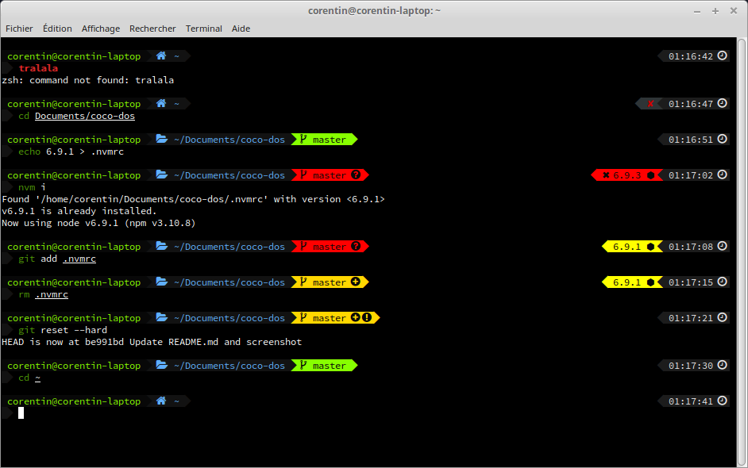

# Coco-Dos

Coco-Dos is a small configuration for ZSH which uses [Antigen](https://github.com/zsh-users/antigen)
plugin manager and [Powerlevel9k](https://github.com/bhilburn/powerlevel9k) theme.

<p align="center">
  
</p>

## Installation

To use this theme, just clone the repository and run the installation script.

```shell
git clone https://github.com/CCheminaud/coco-dos.git
cd coco-dos
chmod +x install.sh
./install.sh
```

With Antigen, all plugins and themes will be installed the next time ZSH is launched !
